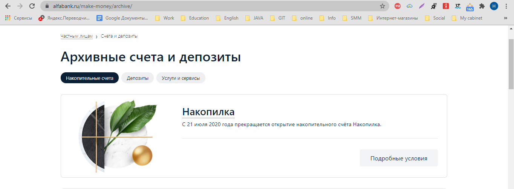

# **План автоматизации тестирования возможности открытия вклада "Накопилка".**

--------------------------------------------------------
### _C 21 июля накопительный счет "Накопилка" более недоступен для открытия и переведён в архив_

---------------------------------------------------------

## Позитивные сценарии (HappyPath):

### _Ввод валидных данных через меню "Вклады"_

1. Перейти на сайт https://alfabank.ru
2. Нажать на вкладку "Вклады" 
3. Нажать на вкладку "Накопительные счета"
4. Нажать на блок "Накопилка" 
5. Нажать на кнопку "Заполнить заявку" 
6. Заполнить поля "Имя" и "Мобильный телефон" валидными данными (Имя:Наталья, Мобильный телефон: +7(922)523-46-79)
7. Нажать на чек-бокс "Я согласен(а) на обработку персональных данных"
8. Нажать на кнопку "Мы перезвоним"
#### Ожидаемый результат:
- Появится сообщение "Спасибо, скоро мы вам перезвоним!"

### _Ввод валидных данных через меню "Накопилка"_

- Вклад уже занесён в архивные "Архивные счета и депозиты".

1. Перейти на сайт https://alfabank.ru
2. Нажать на вкладку "Частным лицам" 
3. Навести курсор на меню "Вклады"
4. Нажать на вкладку "Накопилка" 
5. Нажать на кнопку "Заполнить заявку" 
6. Заполнить поля "Имя" и "Мобильный телефон" валидными данными (Имя:Наталья, Мобильный телефон: +7(922)523-46-79)
7. Нажать на чек-бокс "Я согласен(а) на обработку персональных данных"
8. Нажать на кнопку "Мы перезвоним"

#### Ожидаемый результат:
- Появится сообщение "Спасибо, скоро мы вам перезвоним!"

### _Негативные сценарии_

**Попытка отправить форму с незаполненном полем "Имя"**

1. Перейти на сайт https://alfabank.ru
2. Нажать на вкладку "Частным лицам" 
3. Навести курсор на меню "Вклады"
4. Нажать на вкладку "Накопилка" 
5. Нажать на кнопку "Заполнить заявку" 
6. Поле "Имя" оставить пустым
6. Заполнить поле "Мобильный телефон" валидными данными (Мобильный телефон: +7(922)523-46-79)
7. Нажать на чек-бокс "Я согласен(а) на обработку персональных данных"
8. Нажать на кнопку "Мы перезвоним"

#### Ожидаемый результат:
- Появится сообщение "Это поле обязательно для заполнения!"

**Попытка отправить форму с незаполненном полем "Мобильный телефон"**

1. Перейти на сайт https://alfabank.ru
2. Нажать на вкладку "Частным лицам" 
3. Навести курсор на меню "Вклады"
4. Нажать на вкладку "Накопилка" 
5. Нажать на кнопку "Заполнить заявку" 
6. Заполнить поле "Имя" валидными данными (Имя: Наталья)
6. Полее "Мобильный телефон" оставить пустым
7. Нажать на чек-бокс "Я согласен(а) на обработку персональных данных"
8. Нажать на кнопку "Мы перезвоним"

#### Ожидаемый результат:
- Появится сообщение "Это поле обязательно для заполнения!"

**Попытка отправить форму, когда в поле "Имя" введены цифры**
1. Перейти на сайт https://alfabank.ru
2. Нажать на вкладку "Частным лицам" 
3. Навести курсор на меню "Вклады"
4. Нажать на вкладку "Накопилка" 
5. Нажать на кнопку "Заполнить заявку" 
6. Ввести в поле "Имя" цифры (Имя: 34567898765)
6. Заполнить поле "Мобильный телефон" валидными данными (Мобильный телефон: +7(922)523-46-79)
7. Нажать на чек-бокс "Я согласен(а) на обработку персональных данных"
8. Нажать на кнопку "Мы перезвоним"

#### Ожидаемый результат:
- Появление сообщения "Значение поля может содержать только буквы и дефис"

**Попытка отправить форму, когда в поле "Имя" поставили один пробел**
1. Перейти на сайт https://alfabank.ru
2. Нажать на вкладку "Частным лицам" 
3. Навести курсор на меню "Вклады"
4. Нажать на вкладку "Накопилка" 
5. Нажать на кнопку "Заполнить заявку" 
6. Поставить в поле "Имя" один пробел
6. Заполнить поле "Мобильный телефон" валидными данными (Мобильный телефон: +7(922)523-46-79)
7. Нажать на чек-бокс "Я согласен(а) на обработку персональных данных"
8. Нажать на кнопку "Мы перезвоним"

#### Ожидаемый результат:
- Появление сообщения "Значение поля должно содержать больше одной буквы"

**Попытка отправить форму с не полностью заполненным полем "Мобильный телефон"**

1. Перейти на сайт https://alfabank.ru
2. Нажать на вкладку "Частным лицам" 
3. Навести курсор на меню "Вклады"
4. Нажать на вкладку "Накопилка" 
5. Нажать на кнопку "Заполнить заявку" 
6. Заполнить поле "Имя" валидными данными (Имя: Наталья)
6. Заполнить поле "Мобильный телефон" не полностью (Мобильный телефон: +7(922)523)
7. Нажать на чек-бокс "Я согласен(а) на обработку персональных данных"
8. Нажать на кнопку "Мы перезвоним"

#### Ожидаемый результат:
 Появление сообщения "Проверьте, пожалуйста, номер телефона!"

## _Используемые инструменты:_

##### Java 8. 
- Кросс-платформенная совместимость, автоматическое управление памятью, распространённость.
#### IntelliJ IDEA. 
- Интегрированная среда для написания тестов. Умное автодополнение, анализ кода в реальном времени и надежные рефакторинги.

##### Junit-jupiter 5.6.1. 
- Возможность создавать параметризованные тесты.

##### Selenide 5.11.0. 

- Автоматическое управление браузером, более удобный синтаксис чем у Selenium.

##### Faker. 
- Генератор данных.

##### Allure. 
- Наглядные отчёты.

##### Lombok. 
- Плагин для IDEA, который позволяе сократить время написания кода за счет автоматически генерируемых конструкторов/ геттеров / сеттеров

## _Перечень и описание возможных рисков при автоматизации_
- Возникновение проблем с запуском контейнеров и SUT.
- Отсутствие ТЗ.
- Нехватка времени.

## _Перечень необходимых разрешений/данных/доступов от банка_
- Разрешение на тестирование продукта.
- Спецификация на тестируемый продукт.
- Разрешение и доступ к заглушке БД.

## _Интервальная оценка с учётом рисков (в часах)_
- 20 человекочасов.

## _Перечень необходимых специалистов для автоматизации_
- QA Automation.
- Developer.